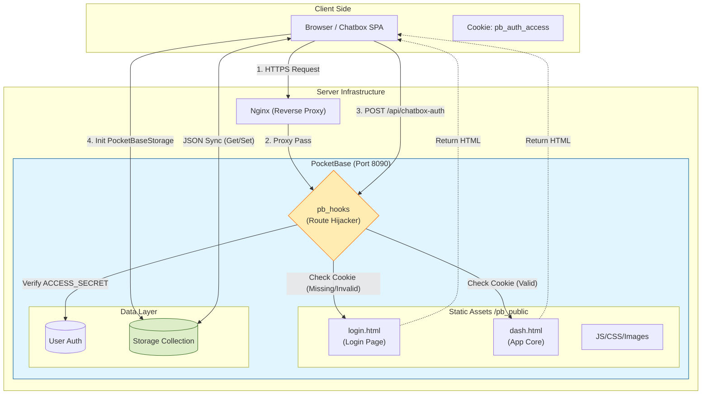

### Introduce (for this fork)

### Brief

此仓库仅仅是 chatbox 的一个后端存储实现 + docker 部署示例，**不保证持续更新！**

This repo is just a backend implementation + Docker demo for Chatbox. **No guarantee of ongoing updates!**

此仓库实现了 chatbox web 模式下的**远端 pocketbase 存储**，原项目是没有这个功能的，多设备切换太麻烦所以做了适配。

This repo adds **remote PocketBase support** to Chatbox (web). The original version didn't support this, so I built this adapter to solve the hassle of syncing data across multiple devices.

在 `/deploy` 目录给出了部署示例，构建完成的镜像极小，仅 50+ MB。

You'll find deployment examples in `/deploy`. The resulting image is tiny—only 50+ MB.

> 我不确定 chatbox 项目本身是否希望自己有这样的功能，所以不会主动发起 PR，随缘更新，有重要特性时可以点个星星催更🤣。
>
> I'm not sure if the Chatbox team intends to have this feature, so I won't be submitting a Pull Request for now. Updates will be made as I see fit. If there's an important feature, give a star to urge an update 🤣.


### Feature

> [!NOTE]
> Only in web deploy mode.

1. **云端同步 / Cloud Synchronizatio**：基于 PocketBase 实现了 Chatbox 的标准存储接口，多设备同步配置和记录。Implements the standard Chatbox storage interface based on PocketBase, enabling multi-device synchronization of configurations and chat history.
2. **简易认证 / Simplified Authentication**：自带登录页，登录后才能访问静态资源；前端和存储之间有鉴权保护，只要密码没泄露就基本保证安全。Includes a built-in login page to restrict access to static resources. Authentication protection between the frontend and storage ensures security provided the password remains confidential.
3. **All-in-One Docker**：单容器一键部署，Docker 镜像包含了 PocketBase 二进制文件和编译后的 Chatbox 前端静态资源。Supports one-click deployment via a single container. The Docker image integrates the PocketBase binary along with the compiled Chatbox frontend static assets.
4. **零配置启动 / Zero-Configuration Startup**：通过 PocketBase pb_hook 机制自动创建数据库表和系统用户，免手工配置。Utilizes the PocketBase `pb_hook` mechanism to automatically initialize database tables and system users, eliminating the need for manual setup.

### Architecture




---
**Fork Introduce end.**

**The following content is from the original repository's README.**

---

<p align="right">
  <a href="README.md">English</a> |
  <a href="./doc/README-CN.md">简体中文</a>
</p>

This is the repository for the Chatbox Community Edition, open-sourced under the GPLv3 license.

[Chatbox is going open-source Again!](https://github.com/chatboxai/chatbox/issues/2266)

We regularly sync code from the pro repo to this repo, and vice versa.

### Download for Desktop

<table style="width: 100%">
  <tr>
    <td width="25%" align="center">
      <b>Windows</b>
    </td>
    <td width="25%" align="center" colspan="2">
      <b>MacOS</b>
    </td>
    <td width="25%" align="center">
      <b>Linux</b>
    </td>
  </tr>
  <tr style="text-align: center">
    <td align="center" valign="middle">
      <a href='https://chatboxai.app/?c=download-windows'>
        
        <br />
        <b>Setup.exe</b>
      </a>
    </td>
    <td align="center" valign="middle">
      <a href='https://chatboxai.app/?c=download-mac-intel'>
        
        <br />
        <b>Intel</b>
      </a>
    </td>
    <td align="center" valign="middle">
      <a href='https://chatboxai.app/?c=download-mac-aarch'>
        
        <br />
        <b style="white-space: nowrap;">Apple Silicon</b>
      </a>
    </td>
    <td align="center" valign="middle">
      <a href='https://chatboxai.app/?c=download-linux'>
        
        <br />
        <b>AppImage</b>
      </a>
    </td>
  </tr>
</table>

### Download for iOS/Android

<a href='https://apps.apple.com/app/chatbox-ai/id6471368056' style='margin-right: 4px'>

</a>
<a href='https://play.google.com/store/apps/details?id=xyz.chatboxapp.chatbox' style='margin-right: 4px'>

</a>
<a href='https://chatboxai.app/install?download=android_apk' style='margin-right: 4px; display: inline-flex; justify-content: center'>

.APK
</a>

For more information: [chatboxai.app](https://chatboxai.app/)

---
<div align="center" markdown="1">
  <a href="https://go.warp.dev/chatbox">
    
  </a>

### [Warp, built for coding with multiple AI agents.](https://go.warp.dev/chatbox)
[Available for MacOS, Linux, & Windows](https://go.warp.dev/chatbox)<br>
</div>

<hr>

<h1 align="center">

<span>
    Chatbox
    <span style="font-size:8px; font-weight: normal;">(Community Edition)</span>
</span>
</h1>
<p align="center">
    <em>Your Ultimate AI Copilot on the Desktop. <br />Chatbox is a desktop client for ChatGPT, Claude and other LLMs, available on Windows, Mac, Linux</em>
</p>

<p align="center">
<a href="https://github.com/chatboxai/chatbox/releases" target="_blank">

</a>
<a href="https://github.com/chatboxai/chatbox/releases" target="_blank">

</a>
<a href="https://github.com/chatboxai/chatbox/releases" target="_blank">

</a>
<a href="https://github.com/chatboxai/chatbox/releases" target="_blank">

</a>
</p>

<a href="https://www.producthunt.com/posts/chatbox?utm_source=badge-featured&utm_medium=badge&utm_souce=badge-chatbox" target="_blank"></a>

<a href="./doc/statics/snapshot_light.png">

</a>
<a href="./doc/statics/snapshot_dark.png">

</a>

<!-- <table>
<tr>
<td>

</td>
<td>

</td>
</tr>
</table> -->

## Features

-   **Local Data Storage**  
    :floppy_disk: Your data remains on your device, ensuring it never gets lost and maintains your privacy.

-   **No-Deployment Installation Packages**  
    :package: Get started quickly with downloadable installation packages. No complex setup necessary!

-   **Support for Multiple LLM Providers**  
    :gear: Seamlessly integrate with a variety of cutting-edge language models:

    -   OpenAI (ChatGPT)
    -   Azure OpenAI
    -   Claude
    -   Google Gemini Pro
    -   Ollama (enable access to local models like llama2, Mistral, Mixtral, codellama, vicuna, yi, and solar)
    -   ChatGLM-6B

-   **Image Generation with Dall-E-3**  
    :art: Create the images of your imagination with Dall-E-3.

-   **Enhanced Prompting**  
    :speech_balloon: Advanced prompting features to refine and focus your queries for better responses.

-   **Keyboard Shortcuts**  
    :keyboard: Stay productive with shortcuts that speed up your workflow.

-   **Markdown, Latex & Code Highlighting**  
    :scroll: Generate messages with the full power of Markdown and Latex formatting, coupled with syntax highlighting for various programming languages, enhancing readability and presentation.

-   **Prompt Library & Message Quoting**  
    :books: Save and organize prompts for reuse, and quote messages for context in discussions.

-   **Streaming Reply**  
    :arrow_forward: Provide rapid responses to your interactions with immediate, progressive replies.

-   **Ergonomic UI & Dark Theme**  
    :new_moon: A user-friendly interface with a night mode option for reduced eye strain during extended use.

-   **Team Collaboration**  
    :busts_in_silhouette: Collaborate with ease and share OpenAI API resources among your team. [Learn More](./team-sharing/README.md)

-   **Cross-Platform Availability**  
    :computer: Chatbox is ready for Windows, Mac, Linux users.

-   **Access Anywhere with the Web Version**  
    :globe_with_meridians: Use the web application on any device with a browser, anywhere.

-   **iOS & Android**  
    :phone: Use the mobile applications that will bring this power to your fingertips on the go.

-   **Multilingual Support**  
    :earth_americas: Catering to a global audience by offering support in multiple languages:

    -   English
    -   简体中文 (Simplified Chinese)
    -   繁體中文 (Traditional Chinese)
    -   日本語 (Japanese)
    -   한국어 (Korean)
    -   Français (French)
    -   Deutsch (German)
    -   Русский (Russian)
    -   Español (Spanish)

-   **And More...**  
    :sparkles: Constantly enhancing the experience with new features!

## FAQ

-   [Frequently Asked Questions](./doc/FAQ.md)

## Why I made Chatbox?

I developed Chatbox initially because I was debugging some prompts and found myself in need of a simple and easy-to-use prompt and API debugging tool. I thought there might be more people who needed such a tool, so I open-sourced it.

At first, I didn't know that it would be so popular. I listened to the feedback from the open-source community and continued to develop and improve it. Now, it has become a very useful AI desktop application. There are many users who love Chatbox, and they not only use it for developing and debugging prompts, but also for daily chatting, and even to do some more interesting things like using well-designed prompts to make AI play various professional roles to assist them in everyday work...

## How to Contribute

Any form of contribution is welcome, including but not limited to:

-   Submitting issues
-   Submitting pull requests
-   Submitting feature requests
-   Submitting bug reports
-   Submitting documentation revisions
-   Submitting translations
-   Submitting any other forms of contribution

## Prerequisites

- Node.js (v20.x – v22.x)
- npm (required – pnpm is not supported)

## Build Instructions

1. Clone the repository from Github

```bash
git clone https://github.com/chatboxai/chatbox.git
```

2. Install the required dependencies

```bash
npm install
```

3. Start the application (in development mode)

```bash
npm run dev
```

4. Build the application, package the installer for current platform

```bash
npm run package
```

5. Build the application, package the installer for all platforms

```bash
npm run package:all
```

## Star History

[](https://star-history.com/#chatboxai/chatbox&Date)

## Contact

[Twitter](https://x.com/ChatboxAI_HQ) | [Email](mailto:hi@chatboxai.com)

## License

[LICENSE](./LICENSE)
